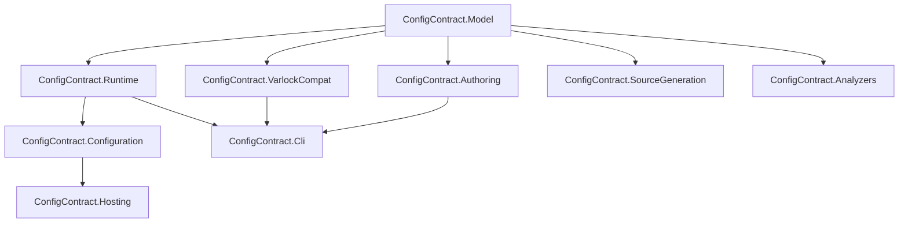

# ConfigContract Repository Architecture

This repository is the dedicated home for ConfigContract, a .NET-first product line for contract-defined application configuration.

The repository does not exist to wrap a JavaScript runtime. It exists to build and ship a native .NET product with its own core model, runtime, tooling, examples, and compatibility boundaries.

## Architectural Principles

### 1. .NET is the product center

The default developer path must work with the .NET SDK, NuGet, standard MSBuild flows, and normal .NET application patterns. Core development, testing, packaging, and production use must not depend on Node.js or any JavaScript runtime.

### 2. The contract model is the stable center

Everything in the repository should converge on one canonical ConfigContract model.

- authoring packages produce the model
- compatibility packages translate into the model
- runtime packages evaluate the model
- tooling packages inspect, validate, or project the model

This keeps compatibility work from leaking into the runtime architecture.

### 3. Compatibility is an adapter boundary

Varlock ingestion is useful for migration, but it is not a core architectural dependency. Compatibility code must stay isolated so the product can evolve on .NET terms.

### 4. Package boundaries reflect real .NET surfaces

Packages should be organized around real consumer seams: model, authoring, runtime, configuration integration, hosting integration, source generation, analyzers, CLI, and compatibility.

### 5. Diagnostics are a first-class feature

If a contract is invalid, an input format is only partially supported, or a compatibility import is lossy, the product should say so explicitly. Silent parity assumptions are not acceptable.

## Repository Shape

This repository should be a dedicated .NET monorepo.

The expected top-level layout is:

```text
docs/
  proposals/
src/
  ConfigContract.Model/
  ConfigContract.Authoring/
  ConfigContract.Runtime/
  ConfigContract.Configuration/
  ConfigContract.Hosting/
  ConfigContract.SourceGeneration/
  ConfigContract.Analyzers/
  ConfigContract.Cli/
  ConfigContract.VarlockCompat/
tests/
  ConfigContract.Model.Tests/
  ConfigContract.Authoring.Tests/
  ConfigContract.Runtime.Tests/
  ConfigContract.IntegrationTests/
  ConfigContract.CompatibilityTests/
examples/
  console/
  aspnetcore/
  worker/
eng/
  scripts/
  packaging/
```

The repository should also carry a solution file, central package management, shared build settings, and CI definitions at the root.

## Package Responsibilities

### `ConfigContract.Model`

Defines the product's canonical contract model.

Responsibilities:

- contract nodes and metadata
- diagnostics primitives and result types
- sensitivity and policy metadata
- common value abstractions used across the stack

This package should stay small, stable, and dependency-light.

### `ConfigContract.Authoring`

Owns first-party contract authoring formats and translation into the canonical model.

Responsibilities:

- parsing first-party contract definitions
- authoring-time validation
- serialization and normalization
- authoring diagnostics

The first-party authoring format is a ConfigContract concern. It must not be defined by imported Varlock behavior.

### `ConfigContract.Runtime`

Executes the contract model for application use.

Responsibilities:

- resolving values and overlays
- applying validation rules at runtime
- preserving sensitivity and metadata semantics
- loading compiled or serialized contract artifacts

This is the runtime heart of the product.

### `ConfigContract.Configuration`

Integrates the runtime with `Microsoft.Extensions.Configuration`.

Responsibilities:

- configuration provider implementation
- binding helpers and projections
- clear error handling for startup and reload paths

### `ConfigContract.Hosting`

Adds ergonomic hosting and DI integration.

Responsibilities:

- `HostApplicationBuilder` extensions
- `WebApplicationBuilder` extensions
- DI registration for runtime services and metadata access

### `ConfigContract.SourceGeneration`

Provides typed access patterns that feel native in .NET.

Responsibilities:

- strongly typed accessors and options projections
- generated metadata helpers
- compile-time feedback integration with analyzers where appropriate

### `ConfigContract.Analyzers`

Provides Roslyn diagnostics and code fixes.

Responsibilities:

- detect invalid or risky consumption patterns
- validate authoring references visible at compile time
- improve developer feedback inside the IDE and build

### `ConfigContract.Cli`

Provides command-line workflows distributed as a `dotnet tool`.

Responsibilities:

- validate contracts
- inspect normalized models
- export artifacts
- run migration and compatibility checks

The CLI should be a first-party .NET tool, not a wrapper over an external JavaScript executable.

### `ConfigContract.VarlockCompat`

Provides Varlock spec ingestion as a bounded compatibility lane.

Responsibilities:

- parse or import supported Varlock inputs
- translate them into the ConfigContract model
- emit explicit diagnostics for unsupported, ambiguous, or lossy semantics
- maintain dedicated compatibility fixtures and tests

This package is important, but it is not upstream of the product center.

## Dependency Direction

The dependency graph should remain disciplined.



Read this as dependency direction, not control flow:

- the model is the common center
- runtime depends on the model
- higher-level integration packages depend on runtime
- compatibility depends inward on the model, never outward from the core runtime

## Testing Strategy

The repository should test the product in layers.

### Unit tests

Each package owns fast tests for its internal behavior and diagnostics.

### Integration tests

Cross-package tests verify runtime loading, configuration binding, hosting integration, and generated output.

### Compatibility tests

Varlock ingestion must have its own fixtures and expectations. Compatibility claims should be explicit, versioned, and allowed to fail independently of first-party authoring work when the support matrix changes.

### Example validation

Examples are part of the product surface and should be built and exercised in CI. They are not marketing-only folders.

## Release and Versioning Stance

The repository should release as one coherent .NET product line until package-level independence becomes operationally necessary.

That implies:

- shared versioning by default
- coordinated docs and examples
- coordinated analyzer, generator, and runtime changes
- a clear support matrix for compatibility adapters

Independent versioning should be introduced only when it reduces real operational cost without obscuring the product surface.

## Hard Boundary Against Bridge-Wrapper Drift

This repository must resist drifting into a bridge-wrapper architecture.

Signs of drift include:

- core packages shelling out to external JavaScript runtimes
- public APIs mirroring another ecosystem instead of .NET idioms
- compatibility packages dictating model or runtime design
- docs that explain the product primarily through another tool's terminology

If those signs appear, the fix is to move the behavior back behind the compatibility boundary or redesign the affected surface around ConfigContract's own model.

## What This Repository Should Feel Like

A contributor or adopter should be able to look at this repository and conclude the following:

- ConfigContract is a real .NET product line
- the core runtime and tooling are native to .NET
- compatibility with Varlock exists, but it is contained and deliberate
- package boundaries are chosen to support long-term product clarity, not short-term bridging convenience

That is the standard this architecture is meant to enforce.